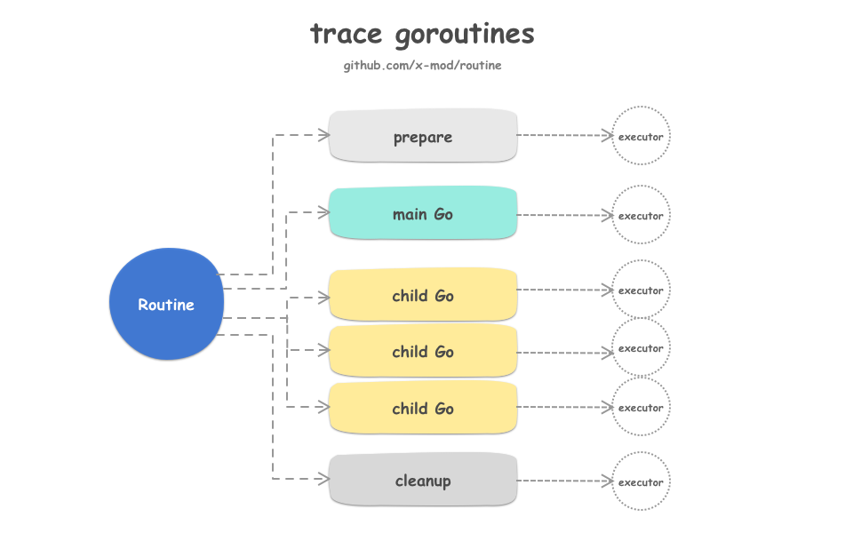
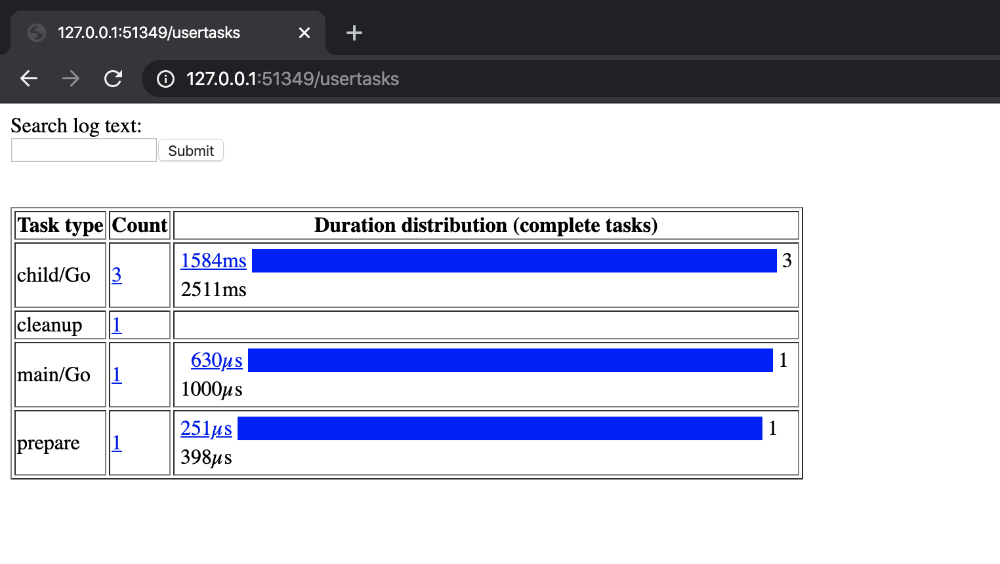

routine
===
[](https://godoc.org/github.com/x-mod/routine) [](https://goreportcard.com/report/github.com/x-mod/routine) [](https://travis-ci.org/x-mod/routine) [](https://github.com/x-mod/routine/releases) [](https://coveralls.io/github/x-mod/routine?branch=master)


## Routine Architecture



## Quick Start

````go
package main

import (
	"log"
	"context"

	"github.com/x-mod/routine"
)

func main(){
	if err := routine.Main(
		context.TODO(),
		routine.Command("echo", routine.ARG("hello routine!")),
	); err != nil {
		log.Fatal(err)
	}
}
````

Or you can just clone the repo, then running `go run quickstart/main.go`.

## Main Routine

The most functional feature is providing the `Main` function abstraction, you can use the `routine.Main` to wrap your main function logic very quickly.

````go
package main

import (
	"context"
	"github.com/x-mod/routine"
)

func MainGo(ctx context.Context) error {
	log.Println("this is the Main Go func")
	return nil
}
func ChildGo(ctx context.Context) error {
	log.Println("this is the Child Go func")
	return nil
}
func prepareGo(ctx context.Context) error {
	log.Println("this is the prepare Go func")
	return nil
}
func cleanupGo(ctx context.Context) error {
	log.Println("this is the Clean Go func")
	return nil
}

func main(){
	log.Println(
		routine.Main(
			context.TODO(),
			//main Go
			routine.ExecutorFunc(MainGo),
			//prpare Go
			routine.Prepare(routine.ExecutorFunc(prepareGo)),
			//cleanup Go
			routine.Cleanup(routine.ExecutorFunc(cleanupGo)),
			routine.Go(routine.ExecutorFunc(ChildGo)),//child Go
			routine.Go(routine.ExecutorFunc(ChildGo)),
			routine.Go(routine.ExecutorFunc(ChildGo)),
			//signals
			routine.Signal(syscall.SIGINT, routine.SigHandler(func() {
				os.Exit(1)
			})),
		),
	)
}

````

## Routine

create and control your own routine by `routine.New`.

````go

import "github.com/x-mod/routine"

err := routine.New(opts...).Execute(ctx)

````

## Executors

The package provides many useful executor adapters for you:

- guarantee
- timeout & deadline
- retry & repeat
- concurrent
- crontab
- parallel & sequence
- command
- profiling

with these executor adapters, you can building the most complex goroutine logic.

````go

import "github.com/x-mod/routine"

//timeout
timeout := routine.Timeout(time.Minute, exec)

//retry
retry := routine.Retry(3, exec)

//repeat
repeat := routine.Repeat(10, time.Second, exec)

//concurrent
concurrent := routine.Concurrent(4, exec)

//schedule executor
crontab := routine.Crontab("* * * * *", exec)

//command
command := routine.Command("echo", routine.ARG("hello routine!"))

//parallel
parallel := routine.Parallel(exec1, exec2, exec3, ...)

//sequence
sequece := routine.Append(exec1, exec2, exec3, ...)
````

# Enjoy

More details, please check the [example](example/main.go) and trace it.

````bash
$: go run example/main.go

# trace go routine & tasks
$: go tool trace  trace.out
````

Then you can check the tasks like this:


